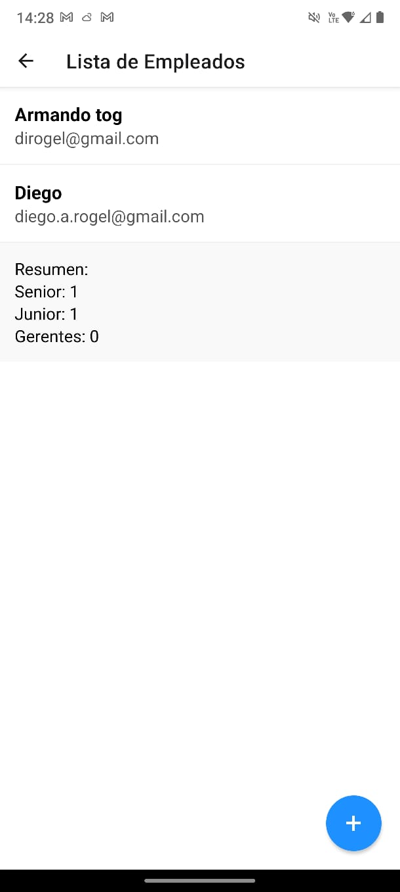
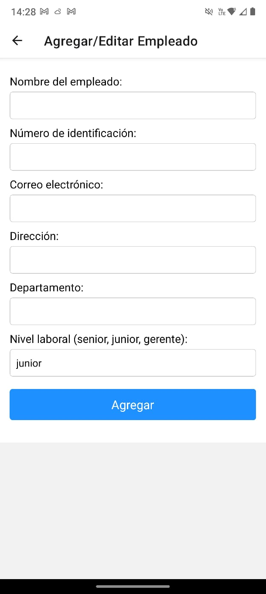

# Aplicativo Móvil: Gestión de Empleados

## Especificaciones

### 1. Crear un aplicativo móvil con las siguientes características:
- **Screen 1**:
  - Deberá mostrar un título: **BIENVENIDO** y un botón con el nombre de **INGRESAR**.
  - Ejemplo de diseño:

    

  - Al presionar el botón **Ingresar**, se debe direccionar al **Screen 2**.

- **Screen 2**:
  - Deberá mostrar una lista de empleados que trabajan en una empresa tecnológica con los siguientes campos:
    - Nombre del empleado
    - Correo electrónico
  - Deberá permitir agregar un nuevo empleado con los siguientes campos:
    - Nombre del empleado
    - Número de identificación
    - Correo electrónico
    - Dirección
    - Departamento
    - Nivel laboral (senior, junior, gerente)

- **Screen 3**:
  - Deberá mostrar la información específica y completa de cada empleado.
  - Se puede acceder al **Screen 3** al dar clic sobre algún empleado de la lista en **Screen 2**.
  - Información mostrada:
    - Toda la información del empleado seleccionado.
    - Botones para editar y eliminar empleados.

---

### 2. Sincronización de datos
- En caso de que un empleado sea registrado, editado o eliminado de forma satisfactoria en la base de datos, el aplicativo deberá refrescar la lista de empleados en **Screen 2** para reflejar los cambios.

---

### 3. Información adicional
- Al final de la lista de empleados en **Screen 2**, se deberá mostrar:
  - La cantidad total de empleados en la empresa.
  - Un desglose de empleados por nivel: **senior**, **junior** y **gerente**.

---

### 4. Estilos
- Es libre de usar cualquier librería de CSS o generar tus propios estilos personalizados.
---

### 5. Capturas de Pantalla
- Es libre de usar cualquier librería de CSS o generar tus propios estilos personalizados.
- **Screen 1: Bienvenido**
  

- **Screen 2: Lista de Empleados**
  

- **Screen 3: Aregar Empleado**
  